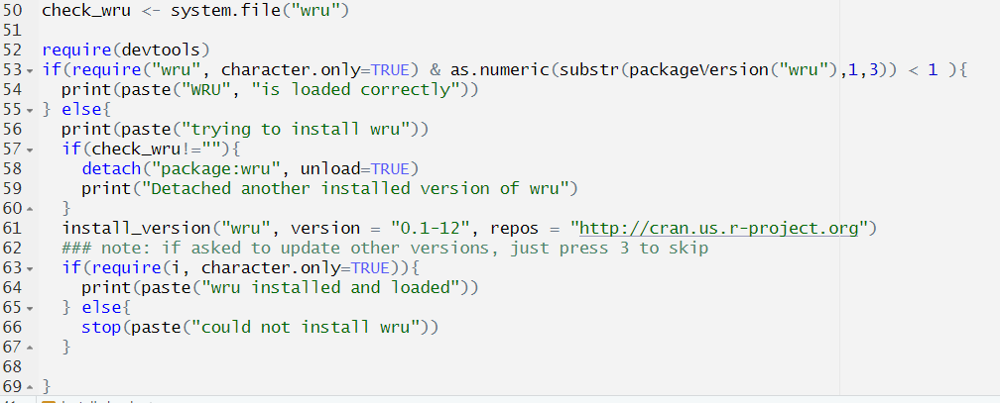

# Outline for tutorial 

- Installing packages 

- Cleaning processes

- Running BISG 

- Validation 

- Applications 


## Checking and installing relevant packages

- Key BISG packages 

  - WRU (Imai & Khanna, 2016) v. 0.1-12
  
  - zipWRUext2 (Clark, Curiel, and Steelman, 2021) 
    
    - install from github 
    
- Preamble "install pkgs" will ensure proper version of packages installed 
    

## Install chunk 

```{r picture of install chunk, out.width = "90%", echo=FALSE, fig.align='center',fig.cap="Version control code" }
#q_order <- readRDS("question_order_vec.rds")



```

```{r install pkgs, include=FALSE, results='hide',message=FALSE,warning=FALSE}
### check for packages 
pkg <- c("stringr","stringi","tidyverse","foreign","conflicted","data.table","raster","gtools","rgdal",
         "ggplot2","ggpubr","rstudioapi","rgeos","scales","splitstackshape",
         "tidyr","devtools", "sf", "geojsonio","lme4","arm","MASS","knitr")

for (i in pkg){
  print(i)
  if(require(i, character.only=TRUE)){
    print(paste(i, "is loaded correctly"))
  } else{
    print(paste("trying to install", i))
    install.packages(i)
    if(require(i, character.only=TRUE)){
      print(paste(i, "installed and loaded"))
    } else{
      stop(paste("could not install", i))
    }
  }
}
###special install for wru 

check_wru <- system.file("wru")

require(devtools)
if(require("wru", character.only=TRUE) & as.numeric(substr(packageVersion("wru"),1,3)) < 1 ){
  print(paste("WRU", "is loaded correctly"))
} else{
  print(paste("trying to install wru"))
  if(check_wru!=""){
    detach("package:wru", unload=TRUE)
    print("Detached another installed version of wru")
  }
  install_version("wru", version = "0.1-12", repos = "http://cran.us.r-project.org")
  ### note: if asked to update other versions, just press 3 to skip
  if(require(i, character.only=TRUE)){
    print(paste("wru installed and loaded"))
  } else{
    stop(paste("could not install wru"))
  }
  
}

####pkgs to be used 
library(foreign)
library(tidyverse)
library(dplyr)
library(raster) # raster (pixel) object handling
library(rgdal) # shapefile access
library(rgeos) # geometry operations
library(stringi) # text processing 
library(stringr) # text processing 
library(splitstackshape)
library(data.table)
library(ggplot2)
library(scales)
library(conflicted)
library(geojsonio)
library(sf) # simple features for spatial objects 
library(lme4)
library(arm)
library(MASS)
library(knitr)
##install the arealOverlap pkg 
#devtools::install_github("https://github.com/jcuriel-unc/arealOverlap2",subdir="arealOverlap")
#library(arealOverlap)
library(wru)
##install the zipWRUext2 pkg 
#devtools::install_github("https://github.com/jcuriel-unc/zipWRUext",subdir="zipWRUext2")
library(zipWRUext2)

### fxn from zipWRUext; revises to be more flexible than v1 ### 
substrRight <- function(x, n){
  substr(x, nchar(x)-n+1, nchar(x))
}
### revision of herfindahl fxn from zipWRUext
race_herfindahl_scores2 <- function (dataframe1) 
{
  if (any(colnames(dataframe1) == "pred_whi") == FALSE) {
    stop("Predicted race variable not present.")
  }
  predNames <- c("pred_whi", "pred_bla", "pred_his", 
                 "pred_asi", "pred_oth")
  dataframe1 <- as.data.frame(dataframe1)
  dataframe1$herf_weight <- (dataframe1$pred_whi)^2 + (dataframe1$pred_bla)^2 + 
    (dataframe1$pred_his)^2 + (dataframe1$pred_asi)^2 + (dataframe1$pred_oth)^2
  dataframe_sub <- subset(dataframe1, select = c(pred_whi, 
                                                 pred_bla, pred_his, pred_asi, pred_oth))
  prob_matrix <- as.matrix(dataframe_sub)
  prob_matrix2 <- apply(prob_matrix, 1, max)
  dataframe1 <- cbind(dataframe1, prob_matrix2)
  colnames(dataframe1)[colnames(dataframe1) == "prob_matrix2"] <- "max_race_prob"
  dataframe1$plural_race[dataframe1$pred_whi == dataframe1$max_race_prob] <- "white"
  dataframe1$plural_race[dataframe1$pred_bla == dataframe1$max_race_prob] <- "black"
  dataframe1$plural_race[dataframe1$pred_his == dataframe1$max_race_prob] <- "hispanic"
  dataframe1$plural_race[dataframe1$pred_asi == dataframe1$max_race_prob] <- "asian"
  dataframe1$plural_race[dataframe1$pred_oth == dataframe1$max_race_prob] <- "other"
  return(dataframe1)
}

```
  

## Loading in MPV data 

```{r data of interest}
### read in the data 
police <- read.csv("data/mpv_df.csv")
## change name for weapon field 
colnames(police)[colnames(police)=="Alleged.Weapon..Source..WaPo.and.Review.of.Cases.Not.Included.in.WaPo.Database."] <-
  "alleged_weapon"
## change weapon field to lower case 
police$alleged_weapon <- str_to_lower(police$alleged_weapon)
```

## Checking the data -- or lack thereof 

```{r checking name fields, results='asis',include=TRUE}

knitr::kable(head(police[,1:5], 10))

```

## Checking for withheld names

```{r name checking, include=TRUE,results='asis'}
### we will want a cleaner version to split of full_name 
police$full_name <- police$Victim.s.Full.name

### note: some names are withheld by police 
print(length(which(police$full_name=="Name withheld by police"))) 
### note: 226 names withheld

# we will now want to create a dummy variable for later, 
#since these will be information where we rely primarily on the geographic component. 
police$name_withheld <- 0
police$name_withheld[police$full_name=="Name withheld by police"] <- 1
## assign generic name 
police$full_name[police$full_name=="Name withheld by police"] <- 
  "Noah A Smith"
```

## Cleaning names: Suffixes 

```{r suffix cleaning, include=TRUE,results='asis'}
#### splitting names and pre-cleaning #####

### get rid of punctuation 
police$full_name <- gsub("[[:punct:]]", " ", police$full_name ) 

## get rid of various suffixes 
police$full_name <- str_replace_all(police$full_name, " IV", "")
police$full_name <- str_replace_all(police$full_name, " III", "")
police$full_name <- str_replace_all(police$full_name, " II", "")
police$full_name <- str_replace_all(police$full_name, " Jr", "")
police$full_name <- str_replace_all(police$full_name, " Sr", "")
```


```{r fullname trimming,include=FALSE}
## create a length field for name; we want to look at those more than 3. 
police$name_length <- lengths(gregexpr("[A-z]\\W+", police$full_name)) + 1L

## remove extra white spaces 
police$full_name <- gsub("\\s+"," ",police$full_name)
police$full_name <- trimws(police$full_name)

## create ID 
police$mpv_id2 <- seq.int(1,nrow(police),by=1)

```

## Splitting names part 1
```{r splitting names part 1,include=TRUE,results='asis'}
### now work on splitting names 
police$first_name <- sapply(strsplit(police$full_name, " "), `[`, 1) # for first name, we are grabbing the portion that is first before the space split. 
# we can likewise see this by going with the "Noah A Smith" example 
sapply(strsplit("Noah A Smith", " "), `[`, 1)  

police$last_name <- sub(".* ", "", police$full_name) 
# for last name, we are pulling the last portion of the full name 
sub(".* ", "", "Noah A Smith") ## we will see what it does to name here; note, the name "Smith" is grabbed. 
#looks like most do not have middle names ;

```

## Splitting names part 2
```{r splitting names part 2,include=TRUE,results='asis'}

summary(police$name_length)  
### assign middle name of "A" based on if 2 length
police$middle_name <- sapply( strsplit(police$full_name, " "), tail, 1)
police$middle_name[police$name_length==2] <- "A"

head(police$last_name)

```

## Prepping the geographic component 

- Reading in sf police data object 

  - Spatial intersected with Census Block Groups (CBGs)
  
  - NOTE: CBG shpfile too large to push to github 
  
- Next steps: Reading in: 
  
  -American Community Survey CBG & ZIP code data 
  
  -Running BISG
  
  - Iterated on missing data/predictions 

## ACS data of interest

```{r reading in geog component, echo=TRUE}

### read in the police sf data 
police_sf <- readRDS("data/police_sf.rds")

## now read in the 5-year ACS data 
cbfs_acs <- read.csv("data/acs2019bisgframe.csv") # CBG
zcta_acs <- readRDS("data/zcta_acs2016_2020.rds") # ZIP code 
kable(head(cbfs_acs[,c(2,19:ncol(cbfs_acs))]))
```

```{r string padding, include=FALSE}
summary(nchar(cbfs_acs$Geo_FIPS))
### not all FIP codes are length 12; 0-pad 
cbfs_acs$Geo_FIPS <- str_pad(cbfs_acs$Geo_FIPS, width=12,side="left",pad="0")
##### Prepping the column names to match for the predict_any merge #####
### now, get the names to be the same as the ACS data 
colnames(police_sf)[colnames(police_sf)=="cbg_fips"] <- "Geo_FIPS"
colnames(police_sf)[colnames(police_sf)=="last_name"] <- "surname"
## predict_race_any uses data frames, not sf; therefore, extract 
police_df <- as.data.frame(police_sf)
```

## Running BISG, CBGs 
```{r BISG component cbgs, warning=FALSE,message=FALSE}
##### Running BISG via the predict_any cmd (zipWRUext & wru) #####
### now, we should be able to run predict_any
police_df <- predict_race_any(police_df, cbfs_acs, c("Geo_FIPS")) 
# arguments: df to be imputed on, the df with the demographic data necessary for the BISG process (r_whi,r_bla,r_his,r_asi,r_oth) ; the fields common in both dfs to do the merge

head(police_df$pred_whi)

```


## Check for missing data 
```{r check missing 1, include=TRUE}

##### Cleaning up the missing data ##### 
### check to ensure no data missing
sum(is.na(police_df$pred_whi)) ## 24 missing; will want to use ZIP code to predict next 
### subset 
police_df_miss <- subset(police_df, is.na(pred_whi)==T)
police_df <- subset(police_df, is.na(pred_whi)==F)

### drop the empty fields 
police_df_miss <- subset(police_df_miss, select=-c(pred_whi,pred_bla,pred_his,pred_asi,pred_oth))

#### read in the other missing data 
police_coord_missing <-readRDS("data/police_coord_missing.rds")
## above split off from the sf version 

```

## Running BISG by ZIP code 

```{r running BISG by ZIP code, include=TRUE, warning=FALSE,message=FALSE}
### read in the zip code data 
colnames(police_df_miss)[colnames(police_df_miss)=="Zipcode"] <- "zcta5"
police_df_miss <- predict_race_any(police_df_miss,zcta_acs,c("zcta5") )
### no failed merges; check data 
sum(is.na(police_df_miss$pred_whi)) # 1 missing observation 
### run zip code bisg 
colnames(police_coord_missing)[colnames(police_coord_missing)=="Zipcode"] <- "zcta5"
colnames(police_coord_missing)[colnames(police_coord_missing)=="last_name"] <- "surname"
police_coord_missing <- predict_race_any(police_coord_missing,zcta_acs,c("zcta5") )
### check missing race data 
sum(is.na(police_coord_missing$pred_whi)) # 13 
```

```{r dataframe matching, include=FALSE}
##### Getting the dataframes to match in columns #####

### let's create a slimmed version of these data sets so that we can later bind these with fewer problems 
police_df_slim <- subset(police_df, select=c(Geo_FIPS,full_name,Victim.s.age,Victim.s.gender,
                                             Victim.s.race,Date.of.Incident..month.day.year.,
                                             Street.Address.of.Incident,City,State,Zipcode,County,
                                             Agency.responsible.for.death,Cause.of.death,alleged_weapon,
                                             name_withheld,mpv_id2,surname,geometry,pred_whi,pred_bla,
                                             pred_his,pred_asi,pred_oth))
colnames(police_df_slim)[colnames(police_df_slim)=="Zipcode"] <- "zcta5"

### missing dfs 
police_df_miss <- subset(police_df_miss, select=c(Geo_FIPS,full_name,Victim.s.age,Victim.s.gender,
                                             Victim.s.race,Date.of.Incident..month.day.year.,
                                             Street.Address.of.Incident,City,State,zcta5,County,
                                             Agency.responsible.for.death,Cause.of.death,alleged_weapon,
                                             name_withheld,mpv_id2,surname,geometry,pred_whi,pred_bla,
                                             pred_his,pred_asi,pred_oth) )
### now the missing coord data
police_coord_missing$Geo_FIPS = NA
police_coord_missing$geometry = NA
police_coord_missing <- subset(police_coord_missing, select=c(Geo_FIPS,full_name,Victim.s.age,Victim.s.gender,
                                             Victim.s.race,Date.of.Incident..month.day.year.,
                                             Street.Address.of.Incident,City,State,zcta5,County,
                                             Agency.responsible.for.death,Cause.of.death,alleged_weapon,
                                             name_withheld,mpv_id2,surname,geometry,pred_whi,pred_bla,
                                             pred_his,pred_asi,pred_oth) )
### create a categorical var for level of geography used for each 

### now, subset the data to the remaining with
police_df_slim$impute_level = "cbg"
police_df_miss$impute_level = "zcta"
police_coord_missing$impute_level = "zcta"
### now assign missing vals 
police_df_miss$impute_level[is.na(police_df_miss$pred_whi)==T] <- "surname"
police_coord_missing$impute_level[is.na(police_coord_missing$pred_whi)==T] <- "surname"
### now, subset the missing data 
police_df_miss_surname <- subset(police_df_miss, is.na(pred_whi)==T)
police_coord_missing_surname <- subset(police_coord_missing, is.na(pred_whi)==T)
### now remove the missing data from the prior sets 
police_df_miss <- subset(police_df_miss, is.na(pred_whi)==F)
police_coord_missing <- subset(police_coord_missing, is.na(pred_whi)==F)
```


## BISG with surname alone
```{r bisg on surname alone, warning=FALSE,message=FALSE}

### run the wru command for surname alone 
police_df_miss_surname <- predict_race(police_df_miss_surname, surname.only = T)
police_coord_missing_surname <- predict_race(police_coord_missing_surname, surname.only = T)
### bind the data 
police_df_miss_surname <- rbind(police_df_miss_surname,police_coord_missing_surname )

head(police_df_miss_surname$pred.whi)

```

```{r combining the data, include=FALSE}

### now, fix the column names 
police_df_miss_surname <- subset(police_df_miss_surname, 
                                 select=-c(pred_whi,pred_bla,pred_his,pred_asi,pred_oth))
## change the names from wru alone 
colnames(police_df_miss_surname)[grepl("pred.", colnames(police_df_miss_surname))] <-
  str_replace_all(colnames(police_df_miss_surname)[grepl("pred.", colnames(police_df_miss_surname))], "pred.", "pred_")
### now combine all of the data 
police_df_slim_final <- rbind(police_df_slim,police_df_miss,police_coord_missing,police_df_miss_surname )
## get year 
police_df_slim_final$year <- substrRight(police_df_slim_final$Date.of.Incident..month.day.year.,4)
#### good, now save 
saveRDS(police_df_slim_final, "data/police_df_slim_final.rds")
rm(police_df_slim,police_df_miss,police_coord_missing,police_df_miss_surname)

```

```{r merging on county covariates, include=FALSE}


### read in the county data 
county_acs <- read.csv("data/complete_county_data.csv")
police_df_slim_final <- readRDS("data/police_df_slim_final.rds")
### select in the vars we want; gini, race, income 
county_acs_slim <- subset(county_acs, select=c(Geo_FIPS,Geo_NAME,Geo_STUSAB,total_pop,pop_ppsm,gini_index,
                                               white_pct,black_pct,asianpi_pct,hispanic_pct,other_pct,
                                               median_income,metro_type,duncan_index))

### change names 
colnames(county_acs_slim)[1:3] <- c("county_fips","county_name","state_po")

## remove county 
county_acs_slim$county_name <- str_remove(county_acs_slim$county_name, "County")
county_acs_slim$county_name <- str_remove(county_acs_slim$county_name, "Parish")

## make upper case 
county_acs_slim$county_name <- str_to_upper(county_acs_slim$county_name)
county_acs_slim$state_po <- str_to_upper(county_acs_slim$state_po)
county_acs_slim$county_name <- trimws(county_acs_slim$county_name)

# 02270, 46113 , 46113
### fix the odd fips error in the county data for SD 
county_acs_slim$county_fips[county_acs_slim$county_fips=="46102"] <- "46113" 

## str width for fips 
county_acs_slim$county_fips <- str_pad(county_acs_slim$county_fips,width=5,side="left",pad="0")

## make upper case for the police data 
police_df_slim_final$County <- str_to_upper(police_df_slim_final$County)

### get county fips for the police df 
police_df_slim_final$county_fips <- substr(police_df_slim_final$Geo_FIPS,1,5)

## some of the police Alaska data off; fix 
police_df_slim_final$county_fips[police_df_slim_final$county_fips=="02270"] <- "02158"


### split on if fips present 
police_df_slim_final_nofips <- subset(police_df_slim_final, is.na(county_fips)==T)
police_df_slim_final_fips <- subset(police_df_slim_final, is.na(county_fips)==F)

### merge based on fips 
police_df_slim_final_test <- merge(police_df_slim_final_fips,county_acs_slim, by=c("county_fips"),all.x=T)

### now merge on by name 

##change names in police data 
colnames(police_df_slim_final_nofips)[colnames(police_df_slim_final_nofips)=="County"] <- "county_name"
colnames(police_df_slim_final_nofips)[colnames(police_df_slim_final_nofips)=="State"] <- "state_po"

##check if the merge works 
police_df_slim_final_testnofips <- merge(police_df_slim_final_nofips,county_acs_slim,  
                                         by=c("county_name","state_po"),all.x=T)

### now, get the data combined 
police_df_slim_final_test <- subset(police_df_slim_final_test, select=-c(County,State))
police_df_slim_final_testnofips <- subset(police_df_slim_final_testnofips, select=-c(county_fips.x))
colnames(police_df_slim_final_testnofips)[colnames(police_df_slim_final_testnofips)=="county_fips.y"] <-
  "county_fips"

police_df_slim_final <- rbind(police_df_slim_final_test,police_df_slim_final_testnofips )

## after this long process, save the data 
saveRDS(police_df_slim_final, "data/police_df_slim_final_w_county_acs.rds")


metro_df <- readRDS("data/metro_seg_full_df.rds")
zip_seg <- readRDS("data/zip_code_segregation_df.rds")


```

# Validation 

Goals  

 - Compare accuracy of aggregated estimates 
 
 - Calculate precision by race 
 
    - $\frac{TP}{TP+FP}$
  
- Estimate geographic sources of error 

## Aggregate estimate comparisons 
 
```{r assign race from MPV pt 1, include=FALSE}
### read in the merged police data 
police_df_slim_final <- readRDS("data/police_df_slim_final_w_county_acs.rds")

### create new official race official data
table(police_df_slim_final$Victim.s.race)
police_df_slim_final$race_simp <- "white"
police_df_slim_final$race_simp[police_df_slim_final$Victim.s.race=="Black"] <- "black"
police_df_slim_final$race_simp[police_df_slim_final$Victim.s.race=="Asian"] <- "asian/pi"
police_df_slim_final$race_simp[police_df_slim_final$Victim.s.race=="Pacific Islander"] <- "asian/pi"
police_df_slim_final$race_simp[police_df_slim_final$Victim.s.race=="Hispanic"] <- "hispanic"
police_df_slim_final$race_simp[police_df_slim_final$Victim.s.race=="Native American"] <- "other"
police_df_slim_final$race_simp[police_df_slim_final$Victim.s.race=="Unknown race"] <- "unknown"
```

```{r compare racial estimates aggregated, include=FALSE}
### collapse the data 
police_df_slim_final_col <- police_df_slim_final %>%
  group_by(race_simp) %>%
  summarise(white=sum(pred_whi),black=sum(pred_bla), hispanic=sum(pred_his) ,asian=sum(pred_asi),
            other=sum(pred_oth))
### get total 
total_num <- rowSums(police_df_slim_final_col[,2:6])
## get pcts 
police_df_slim_final_col_pct <- (police_df_slim_final_col[,2:6]/total_num)*100

## bind prior df first col 
police_df_slim_final_col_pct <- cbind(police_df_slim_final_col[,1],police_df_slim_final_col_pct)

### now make long 
police_df_slim_final_col_pct_long <- police_df_slim_final_col_pct %>%
  pivot_longer(!race_simp, names_to="predicted_race", values_to = "percent" )
police_df_slim_final_col_pct_long$percent <- round(police_df_slim_final_col_pct_long$percent,1)

### now, let's look at diffs in overall counts 

overall_race_diff <- ggplot(police_df_slim_final_col_pct_long, aes(fill=predicted_race, y=percent, x=race_simp, label=percent)) + 
    geom_bar(position="dodge", stat="identity") + theme_minimal() +ylim(0,100) +
  labs(title="Percent composition of BISG predicted race by MPV recorded race", 
       x="MPV recorded race", 
       y="Percent",fill="BISG race",
       caption=paste0("Note: x-axis notes the victim's recorded race as per the Mapping Police Violence data. 
       The bars reflect the aggregated weighted probabilities of BISG estimates.
       Data downloaded: 10/24/2022. N = ", sum(total_num) )) +
    geom_text(position = position_dodge(width = .9),    # move to center of bars
              vjust = -0.5,    # nudge above top of bar
              size = 2) 

```
 
```{r figure 1, warning=FALSE, message=FALSE, echo=FALSE}
overall_race_diff

```

## Precision of BISG estimates 

```{r precision cleaning, include=FALSE}

### use the herfindahl fxn to get plural race 
police_df_slim_final <- race_herfindahl_scores2(police_df_slim_final)

### now have the plural_race; match 
police_df_slim_final <- subset(police_df_slim_final,race_simp != "unknown"  )


### collapse the data 
police_df_slim_final_col <- police_df_slim_final %>%
  group_by(plural_race,race_simp) %>%
  tally()
### get total 
total_num <- sum(police_df_slim_final_col$n)
## get pcts; mutate
police_df_slim_final_col <- police_df_slim_final_col %>%
  group_by(plural_race) %>%
  mutate(plural_sum=sum(n))
police_df_slim_final_col$pct <- round((police_df_slim_final_col$n/police_df_slim_final_col$plural_sum)*100,1)


### let's create a ggplot 
overall_precision_plot <- ggplot(police_df_slim_final_col, aes(fill=race_simp, y=pct, x=plural_race, label = (pct))) + 
    geom_bar(position="dodge", stat="identity") + theme_minimal() +ylim(0,100) +
  labs(title="Percent composition of BISG predicted race by MPV recorded race", 
       x="BISG plurality estimated race", 
       y="Percent",
       caption=paste0("Note: x-axis notes the victim's recorded race as per the Mapping Police Violence data. 
       The bars reflect the aggregated weighted probabilities of BISG estimates.
       Data downloaded: 10/24/2022. N = ", sum(total_num) ), fill="MPV race" ) +
  geom_text(position = position_dodge(width = .9),    # move to center of bars
              vjust = -0.5,    # nudge above top of bar
              size = 2) 


```

```{r precision plot Figure 2, echo=FALSE}
overall_precision_plot

```


## Multilevel modeling 

- DV: Whether MPV and BISG races match 

  - 1 if true, 0 otherwise 
  
- IVs at county level: 

  - Segregation (Duncan-Duncan index)
  
  - Economic equality (Gini Index)
  
  - Metropolitan area type 
  
  - Random intercepts by county 
  
  - N = 8,959
  
## Multilevel modeling results 

```{r multilevel model, include=FALSE}

## change the pred_ names in order to get the plural estimates easily 
police_df_slim_final <- readRDS("data/police_df_slim_final_w_county_acs.rds")


### make the names match 
police_df_slim_final$race_simp <- "white"
police_df_slim_final$race_simp[police_df_slim_final$Victim.s.race=="Black"] <- "black"
police_df_slim_final$race_simp[police_df_slim_final$Victim.s.race=="Asian"] <- "asian"
police_df_slim_final$race_simp[police_df_slim_final$Victim.s.race=="Pacific Islander"] <- "asian"
police_df_slim_final$race_simp[police_df_slim_final$Victim.s.race=="Hispanic"] <- "hispanic"
police_df_slim_final$race_simp[police_df_slim_final$Victim.s.race=="Native American"] <- "other"
police_df_slim_final$race_simp[police_df_slim_final$Victim.s.race=="Unknown race"] <- "unknown"

### now have the plural_race; match 
police_df_slim_final <- subset(police_df_slim_final,race_simp != "unknown"  )

### create dummy var 
police_df_slim_final$race_match <- 0
police_df_slim_final$race_match[police_df_slim_final$race_simp==police_df_slim_final$plural_race] <- 1

### get summary
summary(police_df_slim_final$race_match) # same 77% of time 
quantile(police_df_slim_final$duncan_index, c(0.25,0.5,0.75), na.rm=T)
### create mlm model 
conflicts_prefer(arm::logit)
# commented out model for time; uncomment out to read back in 
#race_model <- glmer(race_match ~ duncan_index + gini_index +  
#                      as.factor(metro_type) + (1|county_fips), data=police_df_slim_final, 
#                      family=binomial(link=logit)  )
# saveRDS(race_model, "data/models/race_model_re.rda")
race_model <- readRDS("data/models/race_model_re.rda")
summary(race_model)


### now plot the results 
set.seed(1337)
random_beta_draws <- mvrnorm(10000, mu=fixef(race_model), Sigma=vcov.merMod(race_model))

### now, proceed to create a df to predict upon 
seg_seq <- seq(0,1,by=0.01) # create range for seg 
df_apply <- data.frame(cbind(1,seg_seq, mean(police_df_slim_final$gini_index, na.rm=T),1,0,0,0))
                 
### apply with matrix mult 
pred_probs <- as.matrix(df_apply) %*% t(random_beta_draws)
## now, apply the results 
pred_probs <- inv.logit(pred_probs)
pred_prob_df <-apply(pred_probs, 1,quantile, probs=c(0.025,.5,.975) )
dim(pred_prob_df)

## #now lets get into a nic df 
pred_prob_df <- t(pred_prob_df)
pred_prob_df <- as.data.frame(pred_prob_df)
colnames(pred_prob_df) <- c("low_ci","median_est","upp_ci")
pred_prob_df <- cbind(pred_prob_df, seg_seq)
colnames(pred_prob_df)[4] <- "segregation"

### now, plot the results 
segreg_ggplot_reg <- ggplot(pred_prob_df, aes(x=segregation, y=median_est)) +
  geom_line(lwd=1.2) + 
  geom_ribbon(aes(ymin=low_ci,ymax=upp_ci), alpha=0.4) + #### very important command; makes the CIs 
  theme_minimal() + ## cleans up the presentation of the plot 
  ylim(0,1) + labs(title="Probability of correct racial match given segregation", x="Duncan-Duncan spatial segregation score (0 = low seg., 1= complete seg.)",
       y="Predicted prob.", 
       caption="The overall accuracy in BISG racial estimates of MPV data matching actual race. N = 8959
       Density plot reflects the distribution of the segregation score."
       ) + 
  geom_density(police_df_slim_final, mapping= aes(x=duncan_index,y=..scaled..), fill="gray90", alpha=0.2) + 
  theme(plot.caption = element_text(hjust = 0))


```


```{r multilevel model Figure 3, warning=FALSE, message=FALSE, echo=FALSE}
segreg_ggplot_reg
```


## Potential applications with BISG estimated data: 

```{r demographics scatterplot, include = FALSE}
police_df_slim_final <- readRDS("data/police_df_slim_final_w_county_acs.rds")

### use the herfindahl fxn to get plural race 
police_df_slim_final <- race_herfindahl_scores2(police_df_slim_final)

### make the names match 
police_df_slim_final$race_simp <- "white"
police_df_slim_final$race_simp[police_df_slim_final$Victim.s.race=="Black"] <- "black"
police_df_slim_final$race_simp[police_df_slim_final$Victim.s.race=="Asian"] <- "asian"
police_df_slim_final$race_simp[police_df_slim_final$Victim.s.race=="Pacific Islander"] <- "asian"
police_df_slim_final$race_simp[police_df_slim_final$Victim.s.race=="Hispanic"] <- "hispanic"
police_df_slim_final$race_simp[police_df_slim_final$Victim.s.race=="Native American"] <- "other"
police_df_slim_final$race_simp[police_df_slim_final$Victim.s.race=="Unknown race"] <- "unknown"

### create final category, this time with imputed race 
police_df_slim_final$final_race <- police_df_slim_final$race_simp
police_df_slim_final$final_race[police_df_slim_final$race_simp=="unknown"] <- 
  police_df_slim_final$plural_race[police_df_slim_final$race_simp=="unknown"]

### check out dist of white pct 
quantile(police_df_slim_final$white_pct, seq(0,1,by=0.05))
quantile(police_df_slim_final$duncan_index, seq(0,1,by=0.05),na.rm=T)

#### now, plot the results 
scatter_plot_demos <- ggplot(data=police_df_slim_final, aes(x=white_pct, y=duncan_index, color=final_race)) +
  geom_point(alpha=0.5) + theme_minimal() + geom_smooth() +
  labs(title="County characteristics for locations for victims of police violence",y="Segregation",
                     x="Percent of County White", color="Race",
                     caption="Data from county level ACS data, 2016-2020.\n Segregation measured via the Duncan-Duncan index, with scores near 0 reflecting no segregation,\n and scores at 1 complete segregation. \n Races that were previously noted as unkown coded with the plurality estimate from BISG.")
ggsave("plots/white_pct_seg_plot.jpeg",
       plot=scatter_plot_demos, scale=1,width=9,
       height=6,units = c("in"),dpi=600, bg="white")

scatter_plot_demos
```

```{r gini scatterplot code, include=FALSE}


### check out dist of white pct 
quantile(police_df_slim_final$gini_index, seq(0,1,by=0.05),na.rm=T)
quantile(county_acs_slim$gini_index, seq(0,1,by=0.05),na.rm=T)

#### now, plot the results 
scatter_plot_gini <- ggplot(data=police_df_slim_final, aes(x=white_pct, y=gini_index, color=final_race)) +
  geom_point(alpha=0.5) + theme_minimal() + geom_smooth() +
  labs(title="County characteristics for locations for victims of police violence",y="Gini",
                     x="Percent of County White", color="Race",
                     caption="Data from county level ACS data, 2016-2020.\n Gini index such that scores near 0 reflect complete economic equality,\n and scores at 1 complete inequality. \n Races that were previously noted as unkown coded with the plurality estimate from BISG.")
ggsave("plots/white_pct_gini_plot.jpeg",
       plot=scatter_plot_gini, scale=1,width=9,
       height=6,units = c("in"),dpi=600, bg="white")

```


```{r gini scatterplot figure 4, warning=FALSE, message=FALSE, echo=FALSE}
scatter_plot_gini

```

# Implications & Discussion

- BISG appears applicable to Mapping Police Violence data 

- Most likely safe to impute for unknown race 

- Should be possible to model noise
  
- Start using to uncover race of police officers? 

## Future project: The police officer perpetrator database 

```{r pilot police name cleaning, include=FALSE}
## because officers sometimes separated by "and" be sure to replace 
police$Names.of.Officers.Involved..DRAFT. <- str_replace_all(police$Names.of.Officers.Involved..DRAFT.,
                                                             "and", ",")
police$Names.of.Officers.Involved..DRAFT. <- str_replace_all(police$Names.of.Officers.Involved..DRAFT.,
                                                             ":", ",")
police$Names.of.Officers.Involved..DRAFT. <- str_replace_all(police$Names.of.Officers.Involved..DRAFT.,
                                                             "/+", ",")
police$Names.of.Officers.Involved..DRAFT. <- str_replace_all(police$Names.of.Officers.Involved..DRAFT.,
                                                             ";", ",")

officer_df <- data.frame()
for (i in 1:nrow(police)) {
  print(i)
  ## grab the list of names if present 
  off_names <- strsplit(police$Names.of.Officers.Involved..DRAFT.[i], ",") 
  off_names <- unlist(off_names)
  ### officer race here 
  off_race <- strsplit(police$Race.of.Officers.Involved..DRAFT.[i], ",")
  off_race <- unlist(off_race)
  ## grab the list of races if present 
  if(identical(off_names, character(0))==T) {
    print("skipping")
  }else{
    new_df <- as.data.frame(cbind(officer_name=off_names, county=police$County[i], 
                                  agency=police$Agency.responsible.for.death[i],mpv_id2=police$mpv_id2[i]))
    if(length(off_race)==0){
      new_df$officer_race <- NA
    }else if(length(off_race) > 0 & length(off_race) <= length(off_names) ){
      new_df$officer_race <- NA
      new_df$officer_race[1:length(off_race)] <- off_race
    }else if(length(off_race) > 0 & length(off_race) > length(off_names)){
      new_df$officer_race <- NA
      new_df$officer_race[1:length(off_names)] <- off_race[1:length(off_names)]
    }
    if(nrow(new_df)>0 & nrow(officer_df)==0){
      officer_df <- new_df
      
    }else if(nrow(new_df)>0 & nrow(officer_df)>0){
      officer_df <- rbind(officer_df, new_df)
    }
    if(exists("new_df")==T){
      rm(new_df)
    }
  }

}

officer_df$officer_name2 <- gsub("\\s*\\([^\\)]+\\)","",as.character(officer_df$officer_name))  
### looks like some of these oddities are cuased by non-clean data for names; let's check for those below a 
# certain character length 
officer_df$name_length <- nchar(officer_df$officer_name2)
## find length under 3 
length(which(officer_df$name_length<4)) # only 102 
summary(officer_df$name_length)
saveRDS(officer_df,"data/rough_police_officer_df.rds")

```

```{r police names, , echo=FALSE}

kable(head(officer_df[,2:6]))

```